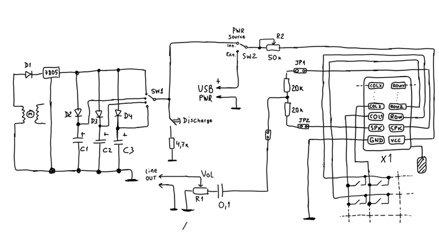
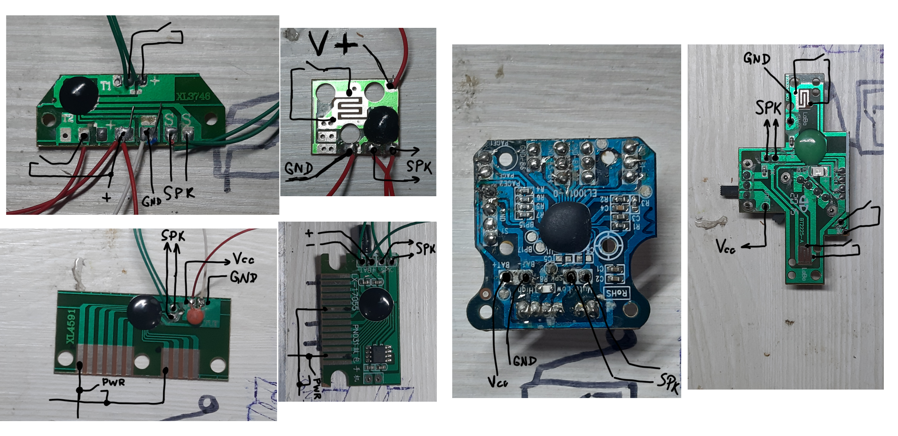

# Sound Chip Playback Device



## Description

The Sound Chip Playback Device is designed to play audio chips from children's toys. The idea behind the device is to reproduce the recorded sounds from these chips not through the toy's built-in speaker, but through the device's line output. The unique feature of this device is the ability to vary the power supply voltage of the chip. Since most sound chips in children's toys use an onboard RC generator as a clock signal, the playback speed of the recorded PCM sample will also depend on the power supply voltage. Essentially, the chip from the toy acts as a sampler with voltage-controlled pitch.

In this device, a stepper motor from a printer is used as the power source. The alternating voltage from the motor's coils is rectified through a diode and then regulated by a 7805 voltage regulator. The regulated voltage is then used to charge a large capacitor, which in turn powers the sound chip. As a result, the power supply voltage is much lower than the chip's normal battery-powered voltage, causing the chip to play the recorded audio at significantly slower speeds. This creates interesting audio effects that can be utilized in electronic music.

Another important feature of the device is its ability to connect a wide range of different chips. This is possible because all sound chips from children's toys have the same physical inputs and outputs. Each chip typically has at least two power supply pins (Vcc, GND), at least two speaker output pins, and two or more play button pins. Usually, pressing the play button triggers the chip to produce sound, such as when you press a plush teddy bear to make it emit a sound. Therefore, the device includes a universal interface for connecting any chips that have the described pinouts.

## Various Chips and Common Interface



## Mechanical Drawing


## Installation

To set up the Sound Chip Playback Device, follow these steps:

1. Clone this repository to your local machine.

```git clone https://github.com/your-username/sound-chip-Playback-device.git```

2. Assemble the hardware components according to the provided schematics and PCB layout.

3. Connect the device to your computer or an audio system using the line output.

4. Adjust the voltage supplied to the chip using the stepper motor to achieve the desired playback speed and audio effects.

## Usage

Once the device is set up and connected, follow these steps to use it:

1. Power on the device using the stepper motor.

2. Connect the desired sound chip to the universal interface, ensuring correct pin alignment.

3. Use the voltage control of the stepper motor to adjust the power supply voltage to the chip and control the playback speed and audio effects.

4. Press the play button on the connected chip to reproduce the recorded sound through the line output.

Experiment with different chips, voltage settings, and audio effects to explore the creative possibilities of the Sound Chip Playback Device.

## Contributing

Contributions to this project are welcome. If you have any ideas, improvements, or bug fixes, please submit a pull request.

## License

This project is licensed under the [MIT License](LICENSE).

---

Enjoy using the Sound Chip Playback Device! If you have any questions or need further assistance, please don't hesitate to contact us.
